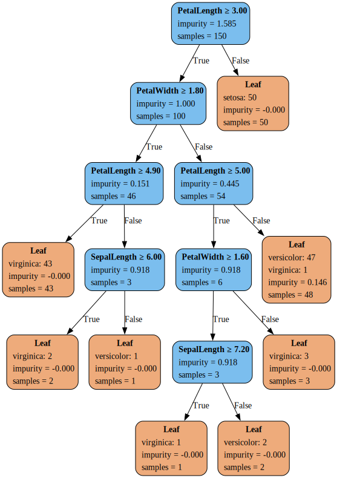

# Decision Tree in Rust

A from-scratch implementation of a CART (Classification and Regression Tree) algorithm in Rust. This project is intended as a learning tool and a demonstration of a performant machine learning model built in a systems language.

It provides a core ```decision_tree``` library and a command-line application (```eval_tree```) for training, evaluating, and visualising modelson CSV datasets.

## Features

* **Core Algorithm**: Builds a decision tree from CSV data using either **Gini Impurity** or **Information Gain** (Entropy) as splitting criteria.
* **Overfitting Control**: Implements two robust types of pruning:
  * **Pre-pruning**: via ```max_depth``` and ```min_samples_split```.
  * **Post-pruning**: Merges branches based on a minimum gain threshold.
* **Classification**: Classifies new data samples, with robust handling of missing feature values (e.g., ```?``` or empty fields).
* **Flexible Evaluation**: Provides three evaluation methods for performance estimates:
  * Simple train/test split.
  * K-Fold Cross-Validation.
  * Evaluation on a separate, pre-defined test file.
* **Visualisation**: Renders the trained decision tree into an image file (.png, .svg, etc.) using Graphviz for easy inspection.
* Builds a decision tree from a CSV dataset.


## Prerequisites

This project requires **Graphviz** to be installed on your system to render the decision tree images.

-   **macOS (using Homebrew):**
    ```bash
    brew install graphviz
    ```
-   **Debian/Ubuntu (using APT):**
    ```bash
    sudo apt-get install graphviz
    ```
-   **Windows (using Chocolatey):**
    ```bash
    choco install graphviz
   

## Building the Project

Clone the repository and build the project in release mode for optimal performance:

``` bash
cargo build --release
```
The executables will be located at ```target/release/demo``` and ```target/release/eval_tree``.

## Usage (eval_tree)

The ```eval_tree``` application is the primary tool for training and evaluation. Run it from your terminal, specifying the dataset and the desired options.

``` text
Usage: eval_tree [OPTIONS] <FILE_PATH>

Arguments:
  <FILE_PATH>  Path to the training CSV dataset file

Options:
      --test-file <TEST_FILE>
          Optional path to a separate CSV test dataset file. If provided, overrides split/k-fold
  -s, --split-ratio <SPLIT_RATIO>
          Proportion for training in a simple split [default: 0.8]
  -c, --criterion <CRITERION>
          The splitting criterion to use [default: gini] [possible values: entropy, gini]
  -p, --prune <PRUNE>
          Minimum gain to keep a branch (0.0 = no pruning) [default: 0.0]
      --plot <PLOT>
          Export the decision tree as a Graphviz image
  -k, --k-folds <K_FOLDS>
          Number of folds for k-fold cross-validation. If > 1, this overrides --split_ratio [default: 0]
      --max-depth <MAX_DEPTH>
          Maximum depth of the tree (None = unlimited)
      --min-samples-split <MIN_SAMPLES_SPLIT>
          Minimum number of samples required to split a node [default: 2]
  -h, --help
          Print help
  -V, --version
          Print version
```

## Examples

The ```data``` folder contains several standard CSV datasets for testing.

| Name              | #Samples   | #Classes   | #Features |
| :-----            | ---:       | ---:       | ---:      |
| Tbc               |     10     |      2     |  5        |
| Iris              |    150     |      3     |  4        |
| Winequality red   |   1607     | 10 (6)     | 11        |
| Winequality white |   4906     | 10 (7)     | 11        |
| Adult train       |  32561     |      2     | 14        |
| Adult test        |  16282     |      2     | 14        |


### 1. Simple Demo: Train on Iris, Prune, and Visualise

The ```demo``` application provides a simple, hardcoded showcase. The command below runs example 2 (the Iris dataset) and plots the resulting tree.

``` bash
cargo run --bin demo 2 --plot Assets/tree_iris.svg
```
This will print the tree structure, classification examples, and save the following visualisation:

|  |
| --- |


### 2. Train/Test Split with Post-Pruning

Train on the Winequality-red dataset [3] using an 80/20 split, apply post-pruning:

``` bash
cargo run --bin eval_tree --release -- data/winequality-red.csv --split-ratio 0.8 --prune 0.4
```

(Note: ```--release``` is recommended for larger datasets.)

``` text
Dataset loaded successfully with 1599 rows.

Performing a simple train/test split...
Data split into 1279 training samples and 320 test samples.
------------------------------
Training the decision tree model (criterion: gini)...
Trained a model with 645 nodes
Pruning the tree with min_gain = 0.4...
A branch was pruned: gain = 0.3200
...snip
A branch was pruned: gain = 0.3750
Pruned down to 523 nodes

Evaluating model accuracy on the test set...

--- Evaluation Result ---
Model Accuracy: 65.00%
------------------------------
```

### 3. K-Fold Cross Validation 

Perform a robust 10-fold cross-validation on the Wine Quality dataset [3].

``` bash
cargo run --bin eval_tree --release -- data/winequality-red.csv -k 10 --prune 0.3
```

Example Output:
```
Dataset loaded successfully with 1599 rows.

Performing 10-fold cross-validation...

--- Fold 1/10 ---
Training on 1440 samples, testing on 159 samples.
Trained a model with 723 nodes
Pruned model down to 643 nodes
Fold 1 Accuracy: 62.26%

...snip

--- Fold 10/10 ---
Training on 1431 samples, testing on 168 samples.
Trained a model with 699 nodes
Pruned model down to 617 nodes
Fold 10 Accuracy: 66.67%

==============================
Cross-Validation Summary
==============================
Average Accuracy: 62.26%
Standard Deviation: 4.35%
==============================
```

### 4. Separate Test Set & Pre-Pruning (Adult Dataset)

Train on the large Adult dataset, which has pre-defined train/test split and contains missing values. Use pre-pruning (`--max_depth` and `--min_samples_split`) to control tree size and prevent overfitting.

``` bash
cargo run --bin eval_tree --release -- data/adult_train.csv --test-file data/adult_test.csv --max-depth 10 --min-samples-split 10
```

``` text
data/adult_train.csv: 32561 data rows
data/adult_test.csv: 16281 data rows
-------------------------------
Training decision tree (criterion: gini)...
Trained a model with 553 nodes

Evaluating model accuracy on the external test set...

--- Evaluation Result ---
Model Accuracy: 86.03%
------------------------------
```

## References

1. [Iris Dataset](https://archive.ics.uci.edu/dataset/53/iris)
2. [Wine Quality Dataset](https://archive.ics.uci.edu/dataset/186/wine+quality)
3. [Modeling wine preferences by data mining from physicochemical properties, Paulo Cortez et al.](https://repositorium.sdum.uminho.pt/bitstream/1822/10029/1/wine5.pdf)
4. [Adult (1994 Census) Dataset](https://archive.ics.uci.edu/dataset/2/adult)

